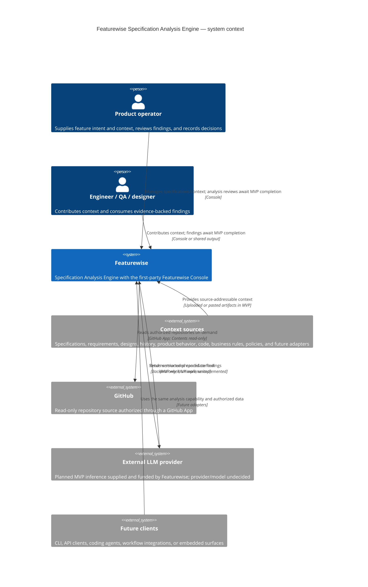

# C4 System Context — Featurewise

## Purpose

This diagram shows Featurewise as a Specification Analysis Engine and the
Featurewise Console as its first-party client. It distinguishes the current
product and system boundaries from the analyzer and analysis endpoints needed
to complete the MVP, which remain unimplemented under ADR-0032. Finding and
review interactions below describe that completion target, not availability.

[ADR-0036](../../adr/ADR-0036-product-direction-and-inference-sources.md)
defines the initial inference as Featurewise-managed. Cloud distribution,
additional clients, and customer-provided inference are later product
directions; this view adds no future execution infrastructure.

## Diagram

## Boundaries

- Featurewise analyzes existing product intent; it does not generate or own the
  canonical specification.
- A Feature is the sole analysis unit. Findings are individually addressable
  and cite exact evidence.
- No context type is the product. Requirements, code, business rules, and
  policies use the same context/evidence architecture rather than separate
  product centers or bespoke pipelines.
- MVP context arrives through specifications, editable context, uploaded or
  pasted artifacts, and the GitHub adapter accepted by ADR-0033. Other source
  adapters remain deferred.
- Human disposition is separate from model output.
- The Console is a client/control plane; engine business logic remains in the
  backend application boundary.
- Other third-party context integrations, customer inference connections,
  public API products, CLI, MCP, and embedded distribution remain deferred.
