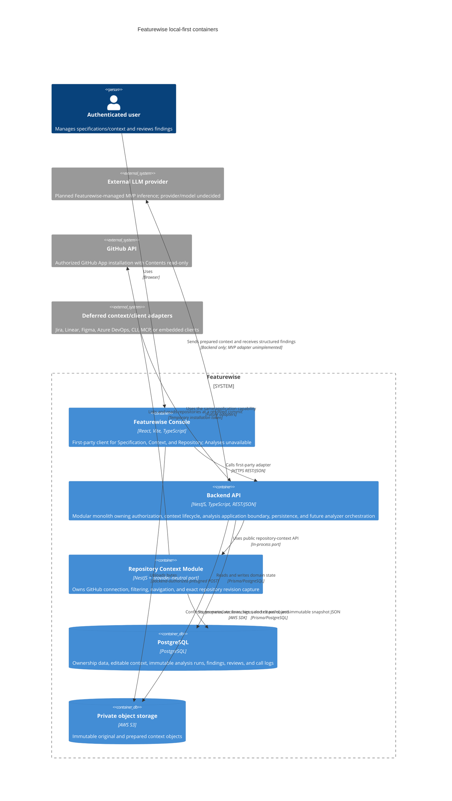

# C4 Container — Featurewise

## Purpose

This diagram shows the container architecture for the local-first MVP. The
React, NestJS, PostgreSQL, and AWS S3 containers implement the current product
boundary; the analysis engine adapter and provider calls remain unimplemented
work required to complete the MVP. Analysis tables and intended finding/review
interactions do not imply an executable analysis workflow.

## Diagram

## Container responsibilities

### Featurewise Console

The React application is the first-party control plane. Its Feature
workspace exposes Specification, Context, Repository, and an unavailable
Analyses surface. It never calls an LLM provider directly and does not own
analysis business logic.

### Backend API

The NestJS modular monolith owns authentication, tenant/project/feature
authorization, feature and project context, the private-file lifecycle, and
the analysis application boundary from ADR-0032. Analysis remains extractable
behind ports, but no queue, worker, dedicated AI service, or microservice is
introduced in the MVP.

### PostgreSQL and S3

PostgreSQL stores relational domain state and immutable analysis metadata. S3
stores private original and prepared file bytes under immutable, versioned
keys. PostgreSQL stores their exact keys, versions, checksums, and lifecycle
metadata; SQL migrations never delete S3 objects.

### External systems

GitHub is the only implemented external repository adapter. It is separated
from S3-backed uploaded artifacts and never creates `StorageObject` rows.
[ADR-0036](../../adr/ADR-0036-product-direction-and-inference-sources.md)
sets the initial inference to one configuration with model access provided
and usage paid for by Featurewise, potentially through its own external
provider account. The provider adapter and analysis execution remain
unimplemented. Customer inference connections, other context/client adapters,
and cloud distribution remain future work; they introduce no MVP containers.
