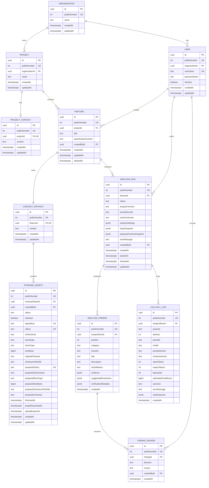

# ERD — Specification Analysis Domain

## Purpose

This is the implemented logical domain model from ADR-0030 through ADR-0032.
The Prisma schema and the forward migration
`20260828000000_specification_analysis_domain` implement these tables and
constraints.

Column names are camelCase here; Prisma maps them to snake_case in PostgreSQL.

## Diagram



Nullable fields are shown without special Mermaid notation. They include
`deletedAt`, prepared object metadata until preparation completes,
`preparedContextSnapshot` until context preparation completes, run error and
lifecycle timestamps, optional LLM usage/cost/error fields, and review reason.

## Required database invariants

- Every externally identifiable domain table keeps its independent positive,
  immutable `publicNumber` contract from ADR-0028. Current prefixes are `PCTX`,
  `RUN`, `FND`, `FREV`, and `CALL`; `UPD` and `SPEC` are removed.
- A Feature has one ContextArtifact from creation. `featureId` is non-null and
  unique; there is no exclusive Feature/FeatureUpdate owner arc.
- At most one non-terminal AnalysisRun exists per Feature. A PostgreSQL partial
  unique index is the race-safe constraint.
- `(analysisRunId, position)` is unique for AnalysisFinding.
- Findings are immutable model assertions. FindingReview rows are append-only;
  latest review is a projection, not a finding status mutation.
- `inputSnapshot` is immutable from run creation.
  `preparedContextSnapshot` may transition once from null to a value and is
  write-once afterward. Run lifecycle state, timestamps, and failure details
  remain mutable.
- Category and severity are schema-versioned strings, not database enums.

## Initial vocabularies

AnalysisRun statuses are exactly:

```text
queued | preparing_context | analyzing | validating_output |
repairing_output | verifying_findings | persisting | completed | failed
```

FindingReview decisions are:

```text
accepted | dismissed | resolved | deferred
```

Initial schema-governed categories are `missing_information`, `ambiguity`,
`inconsistency`, `unresolved_decision`, `missing_edge_case`, `testability`, and
`context_mismatch`. Initial severities are `low`, `medium`, `high`, and
`critical`.

LLM call purposes are `candidate_analysis`, `finding_verification`, and
`schema_repair`; outcomes are `success` or `error`.

## Context snapshot boundary

`inputSnapshot` captures feature specification, feature/project context,
selected ready file identities with exact immutable object versions and
checksums, analysis settings, and source identifiers.
`preparedContextSnapshot` captures the exact source documents and segments
presented to analysis. Finding evidence may reference only source and segment
IDs inside that prepared snapshot. See ADR-0031.

## Migration guard

The `20260828000000_specification_analysis_domain` migration contains a
preflight that stops unless FeatureUpdate, update-owned context/storage
metadata, SpecRun, GeneratedSpec, and legacy LLM log counts are zero. It
preserves Feature-owned ContextArtifact and StorageObject rows and never
deletes S3 objects.
