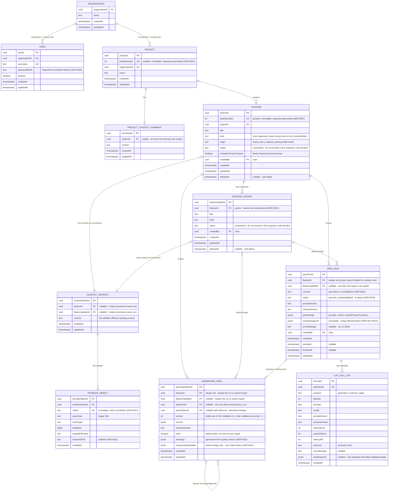

# ERD — Core MVP Domain Model

## Purpose

Canonical entity-relationship model for the phase 1 backend.

Column names are camelCase here; the ORM maps them to snake_case in PostgreSQL.

## Diagram



## Database-level constraints (must exist in the first migration)

```sql
-- Project/Feature public numbers are independent, positive, immutable values.
-- PostgreSQL sequences supply defaults; unique indexes and update-rejection
-- triggers enforce the durable public URL contract (ADR-0027).

-- ContextArtifact: exactly one owner, and each owner has at most one artifact
CHECK (num_nonnulls(feature_id, feature_update_id) = 1);
UNIQUE (feature_id);
UNIQUE (feature_update_id);

-- SpecRun: consolidation runs are feature-target only (ADR-0021)
CHECK (run_kind <> 'consolidation' OR feature_update_id IS NULL);

-- SpecRun: at most one non-terminal run per target (ADR-0019/0020).
-- These indexes are the race-safe source of the 409, not a check-then-insert.
CREATE UNIQUE INDEX one_active_run_per_feature ON spec_run (feature_id)
  WHERE feature_update_id IS NULL AND status NOT IN ('completed','failed');
CREATE UNIQUE INDEX one_active_run_per_update ON spec_run (feature_update_id)
  WHERE feature_update_id IS NOT NULL AND status NOT IN ('completed','failed');

-- GeneratedSpec: sequential validated versions per target (ADR-0021).
-- Drafts use version = 0 and may repeat before validation.
CREATE UNIQUE INDEX spec_version_per_feature ON generated_spec (feature_id, version)
  WHERE feature_update_id IS NULL AND version > 0;
CREATE UNIQUE INDEX spec_version_per_update ON generated_spec (feature_update_id, version)
  WHERE feature_update_id IS NOT NULL AND version > 0;

-- GeneratedSpec: at most one valid spec per target (ADR-0018/0021)
CREATE UNIQUE INDEX one_valid_spec_per_feature ON generated_spec (feature_id)
  WHERE valid AND feature_update_id IS NULL;
CREATE UNIQUE INDEX one_valid_spec_per_update ON generated_spec (feature_update_id)
  WHERE valid AND feature_update_id IS NOT NULL;
```

## Application-level rules (not expressible as simple constraints)

- **Run preconditions (else 422):** `generation` on a Feature requires
  `origin = brand_new`. `generation` on a FeatureUpdate requires a _usable
  parent baseline_. `consolidation` (feature target, any origin) requires at
  least one validated update spec not yet incorporated by the feature's
  current valid spec.
- **Usable baseline** = parent ContextArtifact content is non-empty, OR at
  least one StorageObject exists on it, OR the parent Feature has a valid
  GeneratedSpec.
- An empty ContextArtifact is created automatically, in the same transaction,
  when a Feature or FeatureUpdate is created — that is how the "exactly one"
  invariant holds from birth.
- **Version assignment:** every new GeneratedSpec (run-produced or manual)
  starts as a draft with `version = 0` and `valid = false`.
- **Validity (ADR-0021):** Marking a spec valid assigns the next target-local
  validated version (`1` for the first validation, otherwise `last + 1`) and
  atomically clears the `valid` flag on the previously valid spec of the same
  target.
- Manual (user-created) versions copy `incorporatedUpdates` from their
  `parentSpecId` spec.
- A GeneratedSpec's `featureId`/`featureUpdateId` must equal its run's target
  (run-produced) or its parent's target (manual versions).
- **Alignment is computed, never stored** (see below).
- A Feature or FeatureUpdate with a non-terminal SpecRun cannot be deleted.
- StorageObject rows are immutable; replacing a file means a new row and a new
  S3 key. S3 objects are **never deleted** in phase 1 because SpecRun
  snapshots reference keys (ADR-0017).
- Soft delete (`deletedAt`) exists only on Feature and FeatureUpdate. Runs,
  specs, and logs are immutable history and are never deleted.

## `incorporatedUpdates` JSONB shape (GeneratedSpec, feature target only)

```json
[{ "featureUpdateId": "...", "generatedSpecId": "...", "version": 2 }]
```

## Computed alignment (never stored)

For a Feature, `alignment.status = updates_pending` when at least one
non-deleted FeatureUpdate has a **current valid spec** whose
`generatedSpecId` is not present in the feature's **current valid spec**
`incorporatedUpdates` (a feature with validated updates and no valid spec of
its own is also `updates_pending`). Otherwise `aligned`.

Comparing spec **ids** (not timestamps) means: re-validating an update with a
new spec version automatically re-flags the feature, and soft-deleted updates
drop out of the computation. The API exposes
`alignment: { status, pendingUpdates[] }` on feature reads.

## `contextSnapshot` JSONB shape (SpecRun)

```json
{
    "snapshotVersion": 2,
    "target": "feature | feature_update",
    "runKind": "generation | consolidation",
    "featureContext": {
        "content": "copied text of the (parent) Feature ContextArtifact",
        "storageObjects": [
            {
                "s3Key": "...",
                "assetType": "image",
                "mimeType": "...",
                "originalFilename": "..."
            }
        ],
        "externalRefs": ["e.g. repo@commit, figma link"]
    },
    "updateContext": "same shape as featureContext, or null",
    "featureValidSpec": {
        "generatedSpecId": "...",
        "version": 3,
        "content": {}
    },
    "updatesToIncorporate": [
        {
            "featureUpdateId": "...",
            "generatedSpecId": "...",
            "version": 2,
            "title": "...",
            "content": {}
        }
    ],
    "includeProjectSummary": false
}
```

Field usage per run kind:

| Field                  | generation (feature) | generation (update)        | consolidation                      |
| ---------------------- | -------------------- | -------------------------- | ---------------------------------- |
| `featureContext`       | own context          | parent baseline            | own context                        |
| `updateContext`        | null                 | update context             | null                               |
| `featureValidSpec`     | null                 | parent's valid spec if any | feature's valid spec if any        |
| `updatesToIncorporate` | null                 | null                       | all pending validated update specs |


## Open decisions still pending (tracked, not blockers for the ERD)

- `status` enum values for Feature/FeatureUpdate are unresolved. Do not include
  them in the first migration until the workflow states are explicitly decided.
- ProjectContextSummary has a defined shape but **no write path yet**; its
  generation/update flow needs its own ADR before the entity is more than a
  manually edited text field.
- `normalizedContent` from the old ERD is intentionally dropped for phase 1:
  prompts use `ContextArtifact.content` plus `StorageObject.extractedText`
  directly.
