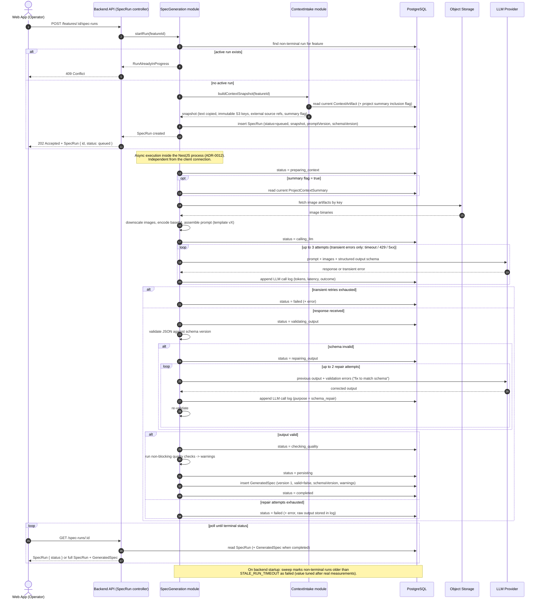

# Sequence — Generate Spec (New Feature)

## Purpose

This diagram defines the behavior of the only complex flow in the MVP: asynchronous spec generation for a `new_feature` run, executed inside the NestJS process (ADR-0012).

It covers the happy path plus the three failure branches that matter:

- concurrent run rejected;
- transient LLM errors with retry;
- schema-invalid output with repair loop, then failure.

CRUD flows (auth, project, feature, context editing) are intentionally not diagrammed.

## Run Status Lifecycle

| Status | Meaning | Terminal |
|---|---|---|
| `queued` | Run created, snapshot persisted, generation not started | no |
| `preparing_context` | Fetching images from S3, downscaling, assembling prompt | no |
| `calling_llm` | LLM request in flight (with transient-error retries) | no |
| `validating_output` | Validating JSON against schema version | no |
| `repairing_output` | Schema-repair round-trip with the LLM | no |
| `checking_quality` | Non-blocking quality checks (warnings only) | no |
| `persisting` | Writing GeneratedSpec and logs | no |
| `completed` | GeneratedSpec available | yes |
| `failed` | Error persisted, raw output logged when relevant | yes |

## API Contract

- `POST /features/:id/spec-runs` → `202 Accepted` + `SpecRun { id, status }`, or `409 Conflict` if a non-terminal run exists for the feature (the FE also disables the trigger).
- `GET /spec-runs/:id` → `SpecRun { status, ... }`; when `completed`, the response embeds the full `GeneratedSpec` object, not only its id.
- Generation is independent of the client connection. Closing the web app does not affect a run. If the backend process stops, in-flight runs die and are handled by the startup sweep.

## Diagram

## Notes

- The new `GeneratedSpec` is created as version 1 with `valid = false`. Marking it valid is a separate user action (ADR-0018), out of scope for this diagram.
- Quality checks never fail a run; they produce warnings stored with the GeneratedSpec.
- Raw LLM output is persisted in the log only for failed validation/repair attempts, to limit DB bloat while keeping failures debuggable.
- `feature_update` runs reuse this flow with a different prompt template and baseline context (ADR-0005); no separate diagram is needed unless the flow actually diverges.

## TLTR

Synchronous part (the HTTP request). The operator hits "generate". The API asks the SpecGeneration module to start a run. The module checks Postgres for a non-terminal run on that feature: if one exists, the request dies with 409. Otherwise, ContextIntake builds the snapshot (copies the text content, records the immutable S3 keys, the external source refs, and the project-summary flag), the module inserts a SpecRun with status queued plus the prompt/schema versions, and the API immediately answers 202 with the SpecRun. The user is now free; nothing else blocks the HTTP connection.
Asynchronous part (inside the Nest process). The module walks the run through the statuses, writing each transition to Postgres so polling always reflects reality:

preparing_context — reads the ProjectContextSummary if the flag is set, fetches images from S3, downscales them, base64-encodes, assembles the prompt from the versioned template.
calling_llm — sends the request; transient errors (timeout/429/5xx) get up to 3 attempts; every attempt writes one LLM call log row. If all 3 fail → failed, done.
validating_output — checks the JSON against the schema version. If invalid → repairing_output: send the bad output plus the validation errors back to the LLM, up to 2 times, re-validating each answer. Still invalid → failed, raw output kept in the log for debugging.
If valid → checking_quality (non-blocking, produces warnings only) → persisting (insert GeneratedSpec as version 1, valid=false, with warnings) → completed.

Polling. Meanwhile, the frontend polls GET /spec-runs/:id in a loop. It gets back the SpecRun with its current granular status; once the status is completed, the response embeds the full GeneratedSpec object. The loop stops on either terminal status.
Safety net. If the backend process dies mid-run, the run is stuck in a non-terminal status forever — so on startup, a sweep marks any non-terminal run older than the timeout as failed.
