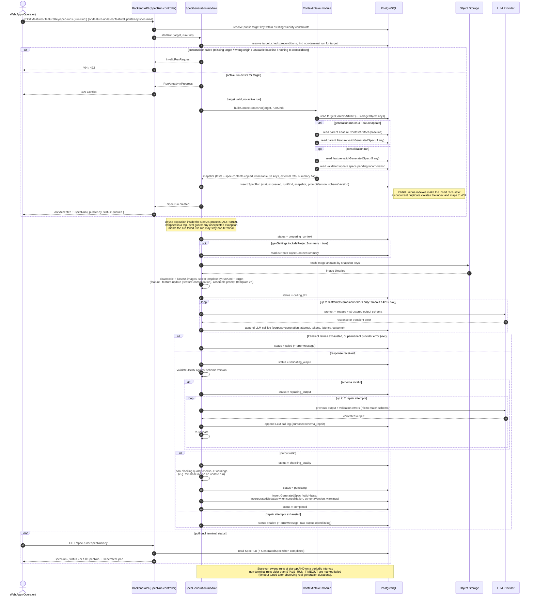
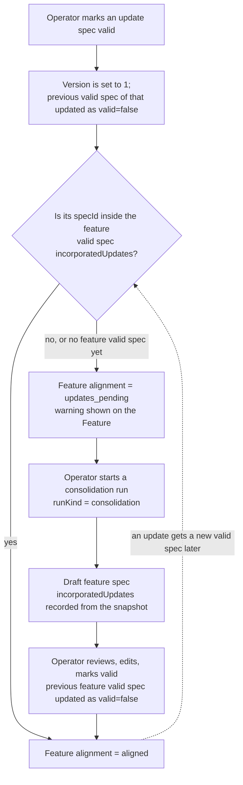

# Sequence — Spec Runs: Generation (Feature / FeatureUpdate) and Consolidation

## Purpose

This diagram defines the behavior of the only complex flow in the MVP:
asynchronous spec runs executed inside the NestJS process (ADR-0012), for the
three run cases defined by ADR-0020/0021:

- `generation` on a Feature with `origin = brand_new` (direct run);
- `generation` on a FeatureUpdate (increment run, parent baseline included);
- `consolidation` on a Feature (absorb validated update specs into a new
  feature-level spec version).

All three share the same status lifecycle and pipeline; only preconditions,
snapshot composition, and the prompt template differ. The second diagram shows
the alignment loop that connects spec validation to consolidation.

CRUD flows (auth, project, feature, feature-update, context editing) are
intentionally not diagrammed.

## Run preconditions and inputs (ADR-0020/0021)

| runKind         | Target               | Allowed when (else 422)                                                                            | Snapshot contains                                                                  |
| --------------- | -------------------- | -------------------------------------------------------------------------------------------------- | ---------------------------------------------------------------------------------- |
| `generation`    | Feature              | `origin = brand_new`                                                                                | feature context                                                                    |
| `generation`    | FeatureUpdate        | usable parent baseline: non-empty parent ContextArtifact, or uploads on it, or a parent valid spec | update context + parent baseline + parent valid spec (if any)                      |
| `consolidation` | Feature (any origin) | ≥ 1 validated feature update spec not yet incorporated                                             | feature context + feature valid spec (if any) + all pending validated update specs |

The prompt template is selected by run kind and target — `new-feature`,
`feature-update`, `feature-consolidation` — all versioned in the repository
(ADR-0013). The project summary inclusion flag (`genSettings`) applies to all
three.

## Run Status Lifecycle

| Status              | Meaning                                                 | Terminal |
| ------------------- | ------------------------------------------------------- | -------- |
| `queued`            | Run created, snapshot persisted, generation not started | no       |
| `preparing_context` | Fetching images from S3, downscaling, assembling prompt | no       |
| `calling_llm`       | LLM request in flight (with transient-error retries)    | no       |
| `validating_output` | Validating JSON against schema version                  | no       |
| `repairing_output`  | Schema-repair round-trip with the LLM                   | no       |
| `checking_quality`  | Non-blocking quality checks (warnings only)             | no       |
| `persisting`        | Writing GeneratedSpec and logs                          | no       |
| `completed`         | GeneratedSpec available                                 | yes      |
| `failed`            | Error persisted, raw output logged when relevant        | yes      |

## API Contract

- `POST /features/:featureKey/spec-runs` body `{ runKind?: "generation" | "consolidation" }`
  (default `generation`) → `202 Accepted` + `SpecRun { publicKey, status }`.
  `422` when: `generation` on a `mapped_existing` Feature, or `consolidation`
  with nothing pending. `409 Conflict` if a non-terminal run exists for this
  target.
- `POST /feature-updates/:featureUpdateKey/spec-runs` (always `generation`) → `202` / `404` /
  `409`; `422` when the parent baseline is not usable.
- `GET /spec-runs/:specRunKey` → the `SpecRun`; when `completed`, the response embeds
  the full `GeneratedSpec` object.
- `GET /features/:featureKey/spec-runs/latest` and
  `GET /feature-updates/:featureUpdateKey/spec-runs/latest` → most recent run for the
  target, any status. **Recovery endpoint**: after a page reload the frontend
  rediscovers an active run and resumes polling.
- `POST /generated-specs/:generatedSpecKey/validate` → marks the spec valid: freezes its
  content and atomically clears the previously valid spec of the same target
  (ADR-0021). This is the event that can flip the parent Feature to
  `updates_pending`.
- `GET /features/:featureKey` → includes the computed
  `alignment: { status: "aligned" | "updates_pending", pendingUpdates: [...] }`.
- The 409 is ultimately enforced by the partial unique indexes on `spec_run`
  (see ERD), not by a check-then-insert — the pre-check is only a fast path.
- Generation is independent of the client connection. Closing the web app does
  not affect a run. Stopping the backend process kills in-flight runs
  (accepted ADR-0012 tradeoff, mitigated by the sweep).
- All identifiers in these HTTP paths and response identity fields are the
  entity-specific public keys from ADR-0028. Controllers resolve them to UUIDs
  before service and database operations. Snapshot UUID references stay
  internal and are never returned to the frontend.

## Diagram — run execution

## Diagram — alignment loop (overview)

## Notes

- **Consolidation is user-triggered only.** Validating an update spec never
  starts a run automatically: automatic regeneration would spend LLM cost
  without review and contradict "valid is a user action" (ADR-0018/0021). The
  computed `updates_pending` warning is the prompt to act.
- **Alignment vs warnings:** `warnings` on a GeneratedSpec are quality checks
  frozen at generation time. Alignment is computed live on every feature read,
  because it changes when updates are validated _after_ the spec was created.
  Do not store alignment.
- The new `GeneratedSpec` is always a draft (`version = 0`, `valid = false`).
  Marking it valid assigns the next target-local validated version, starting at
  version 1, and atomically swaps the `valid` flag for that target.
- Quality checks never fail a run; an update run with a thin baseline that
  still passed the usable-baseline gate produces a warning, not a failure.
- Raw LLM output is persisted in the log only for failed validation/repair
  attempts, to limit DB bloat while keeping failures debuggable.
- Errors are classified before retrying: only timeout/429/5xx are transient.
  4xx provider errors (e.g. payload too large from inline images) fail the run
  immediately.
- Consolidation snapshots copy the spec contents they consume (ADR-0017/0021):
  draft specs are editable, so copying is the only byte-stable option.

## TLDR

### Synchronous part (the HTTP request)

The operator hits "generate" on a Feature (with a runKind) or on a
FeatureUpdate. The module resolves the target and checks the precondition for
that run kind: missing target → 404; unusable parent baseline, or consolidation 
with nothing pending → 422; non-terminal run already on the target → 409. 
Otherwise ContextIntake builds the snapshot: copies the target's context text, 
records immutable S3 keys and external refs, and adds the extra inputs per run kind
— parent baseline plus parent valid spec for update runs; feature valid spec plus all
pending validated update specs for consolidation. The SpecRun is inserted with
status `queued` (the partial unique index guarantees the one-active-run rule
even under a race) and the API answers 202.

### Asynchronous part (inside the Nest process)

The pipeline runs inside a guard that converts any unexpected exception into
`failed`, then walks the statuses, writing each transition to Postgres:
`preparing_context` (summary if flagged, images fetched/downscaled, template
selected by runKind + target, prompt assembled) → `calling_llm` (max 3
transient attempts, one log row each) → `validating_output` → optional
`repairing_output` (max 2) → `checking_quality` (warnings only) →
`persisting` (valid=false, with incorporatedUpdates when consolidating) → 
`completed`; any exhausted branch → `failed`.

### Closing the loop

Validating an update spec mark it as v1 and may flip the Feature to
`updates_pending` (computed by comparing spec ids against the feature valid
spec's `incorporatedUpdates`). The operator runs a consolidation, reviews the
draft, marks it valid — the Feature is `aligned` again until the next update
is validated. Changing an update with a new version re-flags the Feature
automatically.

### Polling, recovery, safety net

The frontend polls `GET /spec-runs/:specRunKey` until a terminal status;
after a reload it rediscovers an active run via the target's public-key latest
run endpoint.
The stale-run sweep (startup + periodic) marks non-terminal runs older than
`STALE_RUN_TIMEOUT` as failed, so a stuck run can never block its target with
eternal 409s.
