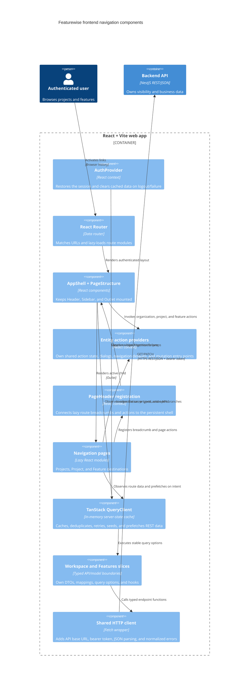

# C4 Component — Frontend Navigation

## Purpose

This document describes the Phase 1 authenticated platform navigation implemented by the React web application. It covers route ownership, the persistent application shell, Sidebar behavior, REST server-state caching, lazy loading, and communication with the existing NestJS API.

The navigation exposes Projects, a selected project's Features, and a minimal
Feature destination. Organization/project metadata and Feature create,
quick-edit, and delete actions are shared across the shell and route pages.
Context, generated-spec, validation, and generation workflows remain dedicated
Feature-page milestones.

## Routes and persistent layout

The authenticated route tree keeps `AppShell` and `PageStructure` mounted above all three lazy child pages:

- `/` renders the Projects list and is also the application home.
- `/projects/:projectId` renders the selected project and its feature links.
- `/projects/:projectId/features/:featureId` renders the selected feature title and a future-work placeholder.

`PageStructure` owns the single `main` landmark. Its Header, Sidebar visibility,
Sidebar width, accordion state, user menu, action providers, and query
observers survive child-route navigation. Lazy pages register their dynamic
PageHeader breadcrumb, subtitle, and actions with the shell and render content
sections only.

The Header logo and the Projects node List action both navigate to `/`. Shared UI stays router-neutral through `NavigationLinkComponent`; the app adapter renders React Router `Link`, while Storybook and isolated component tests default to native anchors.

## Sidebar hierarchy and actions

The Sidebar is derived from cached REST resources and has one nesting level ready for future feature navigation:

```text
Projects node
└── Project group
    └── Features node
        └── Feature group
```

- **Projects node:** its hover List action navigates to `/`. It has no Add action.
- **Project group:** opening it enables the project's feature query. Its Go-to
  action navigates to the project route and its menu opens shared project edit.
- **Features node:** its Add action opens shared Feature creation. It has no
  List action because the project page owns the feature list.
- **Feature group:** its Go-to action navigates to the feature route. Its menu
  opens shared Feature edit and delete. Expanding the group displays a
  future-navigation empty message.

Selection IDs are stable (`projects`, `project:<id>`, `features:<projectId>`, and `feature:<id>`). The URL determines the current item and the shared Sidebar marks its ancestors.

## Server-state and communication

One QueryClient is mounted above authentication and routing. Authentication failure and logout clear the whole cache before another session can use it.

| Resource | Query key | Freshness |
| --- | --- | --- |
| Organization | `['organization', organizationId]` | 5 minutes |
| Projects | `['projects', organizationId]` | 5 minutes |
| Project | `['project', projectId]` | 5 minutes |
| Project features | `['features', projectId]` | 1 minute |
| Feature | `['feature', featureId]` | 1 minute |

Organization and projects start concurrently after authentication. Feature collections start only when a project page needs them, a project accordion opens, or pointer/keyboard intent prefetches them. All three paths use the same query options, so TanStack Query deduplicates concurrent requests and skips fresh data.

Successful mutations update the relevant detail and collection caches.
Creation seeds the Feature detail and project collection caches; deletion
removes both only after the backend succeeds. There are no optimistic updates.

Project and feature detail queries use fresh collection entries as initial data and inherit the collection's update timestamp. Direct deep links fall back to the existing detail endpoints. No navigation aggregate, GraphQL endpoint, polling, or frontend persistence is introduced.

Errors are local to their owning surface: shell-level organization failure blocks the authenticated layout with Retry; project/feature list failures render route or branch feedback; malformed, inaccessible, mismatched, and missing resources render not-found states. Network and 5xx responses retry once, while 4xx responses do not retry.

## Component diagram



## Performance boundaries

- Lazy child routes produce separate production chunks.
- The persistent shell avoids remounting global navigation during route changes.
- Query results remain the source of truth; pages do not copy REST data into local state.
- Sidebar trees and cross-boundary handlers are derived with stable memoization.
- Prefetch is intent-based rather than eager for every feature collection.
- Cache freshness, not component mount count, determines whether another request is needed.
- Backend response contracts and visibility rules remain unchanged; further transport optimization requires measurement before an architectural change.
