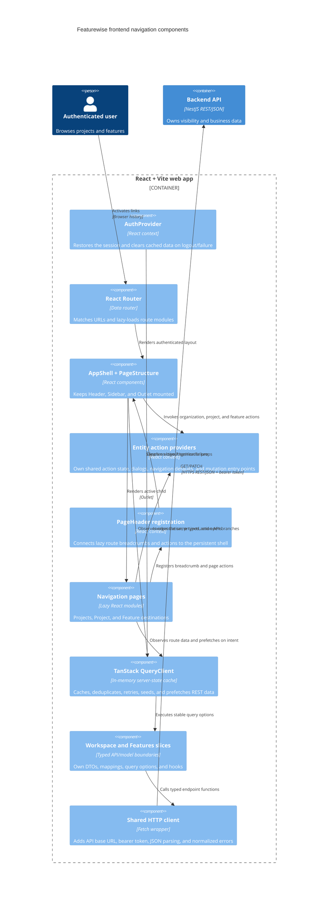

# C4 Component — Frontend Navigation

## Purpose

This document describes the Phase 1 authenticated platform navigation implemented by the React web application. It covers route ownership, the persistent application shell, Sidebar behavior, REST server-state caching, lazy loading, and communication with the existing NestJS API.

The navigation exposes Projects, a selected project's Features, and a Feature
workspace with Context, Generations, Updates, and Specifications tabs.
Organization/project metadata and Feature create, quick-edit, and delete
actions are shared across the shell and route pages. The tab shell is
implemented; context editing, generation, update, specification, and validation
workflows remain dedicated Feature-page milestones.

## Routes and persistent layout

The authenticated route tree keeps `AppShell` and `PageStructure` mounted above all three lazy child pages:

- `/` renders the Projects list and is also the application home.
- `/projects/:projectKey` renders the selected Project workspace. Its `tab`
  query parameter supports `features` and `context`; missing or invalid values
  resolve to `features`. The context tab currently persists only Feature
  membership. ProjectContextSummary content editing and recalculation remain
  deferred until their backend workflow is defined.
- `/projects/:projectKey/features/:featureKey` renders the selected Feature
  workspace. Its `tab` query parameter supports `context`, `generations`,
  `updates`, and `specifications`; missing or invalid values resolve to
  `context`.

Project and Feature keys are backend-generated public identifiers (`PRJ-*` and
`FEAT-*`). Central route builders create all new links from response
`publicKey` values. Read and mutation APIs accept only the entity-specific
public keys. Legacy UUID locations are rejected and are not canonicalized.
Domain UUIDs remain backend-internal and are never received, stored, derived,
routed with, or sent by the frontend (ADR-0028).

`PageStructure` owns the single `main` landmark. Its Header, Sidebar visibility,
Sidebar width, accordion state, user menu, action providers, and query
observers survive child-route navigation. Lazy pages register their dynamic
PageHeader breadcrumb, subtitle, and actions with the shell and render content
sections only.

The Header logo and the Projects node List action both navigate to `/`. Shared UI stays router-neutral through `NavigationLinkComponent`; the app adapter renders React Router `Link`, while Storybook and isolated component tests default to native anchors.

## Sidebar hierarchy and actions

The Sidebar is derived from cached REST resources and has one nesting level ready for future feature navigation:

```text
Projects node
└── Project group
    └── Features node
        └── Feature group
```

- **Projects node:** its hover List action navigates to `/`. It has no Add action.
- **Project group:** opening it enables the project's feature query. Its Go-to
  action navigates to the project route and its menu opens shared project edit.
- **Features node:** its Add action opens shared Feature creation. It has no
  List action because the project page owns the feature list.
- **Feature group:** its Go-to action navigates to the feature route. Its menu
  opens shared Feature edit and delete. Expanding the group displays a
  future-navigation empty message.

Selection IDs are stable (`projects`, `project:<publicKey>`,
`features:<projectPublicKey>`, and `feature:<featurePublicKey>`). The URL
determines the current item and the shared Sidebar marks its ancestors.

## Server-state and communication

One QueryClient is mounted above authentication and routing. Authentication failure and logout clear the whole cache before another session can use it.

| Resource | Query key | Freshness |
| --- | --- | --- |
| Organization | `['organization', organizationKey]` | 5 minutes |
| Project summaries, including active-feature count | `['projects', organizationKey]` | 5 minutes |
| Project | `['project', projectKey]` | 5 minutes |
| Project features | `['features', projectKey]` | 1 minute |
| Feature | `['feature', projectKey, featureKey]` | 1 minute |

Organization and project summaries start concurrently after authentication. The
project-summary response includes the count of non-deleted Features so the
Projects page does not eagerly load every Feature collection. Feature
collections start only when a project page needs them, a project accordion
opens, or pointer/keyboard intent prefetches them. All three paths use the same
query options, so TanStack Query deduplicates concurrent requests and skips
fresh data.

Successful mutations update the relevant detail and collection caches.
Creation seeds the Feature detail and project collection caches; deletion
removes both only after the backend succeeds. There are no optimistic updates.
Successful Feature creation and deletion also adjust the cached project-summary
count at the app composition boundary.

Project and feature detail queries use fresh collection entries as initial data
and inherit the collection's update timestamp. Direct deep links use public-key
Project and nested Feature read endpoints. The nested Feature endpoint verifies
Project membership. Project feature reads also expose backend-derived
activity: direct generation-run count, current valid-spec version, and the
latest feature-target run's kind, status, and project-summary inclusion setting.
The Project context tab keeps an explicit local membership draft, then
pessimistically PATCHes only changed Features; successful responses update the
shared detail and collection caches. No navigation aggregate, GraphQL endpoint,
polling, or frontend persistence is introduced.

Errors are local to their owning surface: shell-level organization failure blocks the authenticated layout with Retry; project/feature list failures render route or branch feedback; malformed, inaccessible, mismatched, and missing resources render not-found states. Network and 5xx responses retry once, while 4xx responses do not retry.

## Component diagram



## Performance boundaries

- Lazy child routes produce separate production chunks.
- The persistent shell avoids remounting global navigation during route changes.
- Query results remain the source of truth; the Project context membership selector copies only an explicit, unsaved editing draft into local state.
- Sidebar trees and cross-boundary handlers are derived with stable memoization.
- Prefetch is intent-based rather than eager for every feature collection.
- Cache freshness, not component mount count, determines whether another request is needed.
- Backend visibility rules remain unchanged; further transport optimization
  requires measurement before an architectural change.
