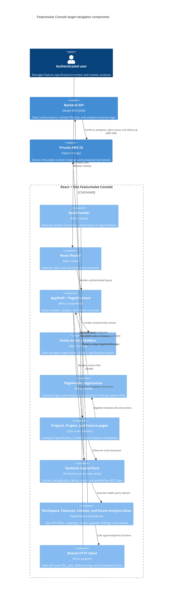

# C4 Component — Featurewise Console Navigation

## Purpose and implementation status

This document describes the accepted target navigation for the Featurewise
Console while preserving the current React architecture, route ownership,
persistent shell, and TanStack Query boundaries. The product terminology and
tabs are implemented in later refactor phases; analysis execution and findings
UI remain unavailable until a real backend vertical slice exists.

## Target routes and workspaces

- `/` renders Projects and remains the application home.
- `/projects/:projectKey` renders a Project workspace with `features` and
  `context` tabs. ProjectContext becomes editable only after the corresponding
  backend contract is implemented.
- `/projects/:projectKey/features/:featureKey` renders a Feature workspace with
  `specification`, `context`, and `analyses` tabs. Missing or invalid values
  resolve to `specification`.

The Specification tab edits the user's canonical
`Feature.specificationContent`. Context edits separate supporting
`ContextArtifact.content` and selected/archived files. Analyses honestly shows
an unavailable or empty state until real endpoints exist; it must not issue a
fake request.

Project and Feature public keys (`PRJ-*` and `FEAT-*`) remain the only frontend
identifiers. Central route builders create links from response `publicKey`
values. UUIDs stay backend-internal under ADR-0028.

## Persistent layout and ownership

`AppShell` and `PageStructure` remain mounted above lazy route pages.
`PageStructure` owns the single `main` landmark. Header, Sidebar, user menu,
action providers, query observers, and PageHeader registration survive child
navigation.

The Sidebar hierarchy remains:

```text
Projects
└── Project
    └── Features
        └── Feature
```

Workspace and Features slices own typed API contracts, mappings, queries,
forms, actions, and cache updates. Context owns supporting text and the private
file lifecycle. A later Analysis slice will own runs, findings, evidence, and
review behavior; it must call the backend application boundary rather than
contain engine rules.

## Server-state boundaries

TanStack Query remains the Console server-state cache and React Router remains
the URL/navigation owner. Existing organization, project, feature, feature
context, and file-archive query policies stay in force until their owning
implementation phase changes the corresponding contract.

Removed product projections include generated-spec version/count, generation
activity, FeatureUpdate state, and alignment. Analysis query keys, polling,
findings, and review mutations are added only with real endpoints. No
placeholder cache entry is introduced during the documentation reset.

## Component diagram



## Performance and failure boundaries

- Lazy child routes remain separate production chunks and the persistent shell
  avoids global remounts.
- Cached server data remains the source of truth; local state is limited to
  explicit editing drafts.
- Prefetch remains intent-based and freshness determines repeat requests.
- Authorization and resource visibility stay backend-owned.
- Errors remain local to their owning shell, page, context/file, or future
  analysis surface.
